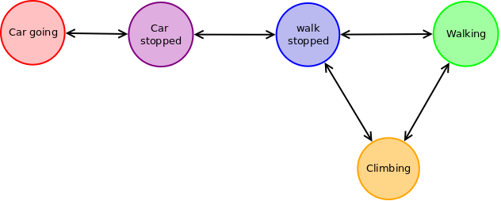

```{r setup, include=FALSE}
knitr::opts_chunk$set(echo = TRUE)
```

```{r load_dataset, cache=TRUE, include=FALSE}
# excluded a couple of files with little to no data
datapaths <- paste("parsed_data/200810", c("09", "10", "11", "12", "17", "18", "19", "20", "21", "22", "23", "24"), ".gpx.csv", sep = "")

datasets <- list()
for(i in 1:length(datapaths)) {
  p <- datapaths[i]
  data <- read.csv(p)
  datasets[[i]] <- data
}
```


```{r preprocess_data_geodiff, cache=TRUE, dependson=c("load_dataset"), include=FALSE}
geodiff_time <- function (data, min_time=60) {
  require(geosphere, quietly = TRUE)
  if (dim(data)[1] < 2) {
    return(NA)
  }
  new_colnames <- c("dist", "bearing", "dt", "t", "tracknum")
  diffdata <- matrix(0, dim(data)[1] - 1, length(new_colnames))
  colnames(diffdata) <- new_colnames
  
  diffdata <- as.data.frame(diffdata)
  
  k <- 1
  for (i in 1:(dim(data)[1] - 1)) {
    # distance in meters
    #diffdata[i, "dist"] <- distm(c(data[i, "lon"], data[i, "lat"]), c(data[i+k, "lon"], data[i+k, "lat"]), fun = distHaversine)
    while (i + k < dim(data)[1] && data[i+k, "t"] - data[i, "t"] < min_time) {
      k <- k+1
    }
    diffdata[i, "dist"] <- distm(c(data[i, "lon"], data[i, "lat"]), c(data[i+k, "lon"], data[i+k, "lat"]), fun = distVincentyEllipsoid)
    # bearing
    diffdata[i, "bearing"] <- bearingRhumb(c(data[i, "lon"], data[i, "lat"]), c(data[i+k, "lon"], data[i+k, "lat"]))
    if (is.na(diffdata[i, "bearing"])) {
      diffdata[i, "bearing"] <- 0
    }
    diffdata[i, "dt"] <- data[i+k,"t"] - data[i, "t"]
    diffdata[i, "t"] <- data[i, "t"]
    diffdata[i, "tracknum"] <- data[i, "tracknum"]
    diffdata[i, "ele"] <- data[i, "ele"]
    diffdata[i, "dele"] <- data[i + k, "ele"] - data[i, "ele"]
    k <- k-1
  }
  return(diffdata)
}

ddata <- list()
for (i in 1:length(datasets)) {
  ddata[[i]] <- geodiff_time(datasets[[i]], min_time = 60)
}
```

```{r preprocess_data_db, cache=TRUE, dependson=c("preprocess_data_geodiff"), include=FALSE}
eval_bearing_average <- function(bearings, k=5) {
  res <- vector(length=length(bearings)-k+1)
  for (i in 1:(length(bearings)-k+1)) {
    res[i] <- abs(sum(exp(1i * bearings[i:(i+k-1)] / 360 * 2 * pi)) / k)
  }
  res <- c(res, as.vector(matrix(0, nrow=k-1, ncol=1)))
  return(1 - res)
}

for (i in 1:length(ddata)) {
  ddata[[i]]$db <- eval_bearing_average(ddata[[i]]$bearing, k=10)
}
```


```{r preprocess_data, cache=TRUE, dependson=c("preprocess_data_geodiff", "preprocess_data_db"), include=FALSE}

```

# Input data

Each data file covers one day of tracking (varying from 3 to 20 hours). 
Each file consists of several tracks (typically from 2 to 13), each track has several datapoints (total count of datapoints in one file varies from 1000 to 5000). 
Each datapoint has 4 properties: longitude, latitude, elevation and timestamp.

We decided to drop data about tracks, as for usually most of datapoints are stored in one track.

```{r, echo=FALSE}
require(scatterplot3d, quietly = TRUE)
require(scales, quietly = TRUE)
example_i <- 1
scatterplot3d(
  datasets[[example_i]]$lon, datasets[[example_i]]$lat, datasets[[example_i]]$ele, 
  cex.symbols=0.1, 
  color=alpha("purple", 0.3),
  xlab="Longitude", ylab="Latitude", zlab="Elevation",
  main="Example of track"
)
```


# Task 

Our task is to decide, for each datapoint, whether the user has been *driving a car*, *walking*, or *standing still*, using hidden Markov models.

# Preprocessing of data

Main idea to detect the type of activity is by analysing the speed, difference in elevation, etc. So we have to evaluate the difference between two points. In order to decrease noise in the data, we have evaluated, for each datapoint, the difference with a 60 seconds lag.
We have extracted several factors from the given data (we will call them "diffpoints" or "diffdata" for the rest of the report):

- `dist`: distance (in meters) between compared datapoints
- `bearing`: azimuth (in degrees, from 0 to 360), the orientation of a speed vector
- `dt`: time difference (in seconds) between compared datapoints
- `dele`: difference in elevation (in meters) between compared datapoints
- `db`: characterisation of irregularity of bearing (real number from 0 to 1; 1 - uniformly random changings in bearing, 0 - constant bearing)

Variables `dist` and `bearing` are evaluated using R package _geosphere_ functions `distVincentyEllipsoid()` and `bearingRhumb`, respectively.

Variable `db` is evaluated in the following way: we pick bearings of $k$ consequent diffpoints (in our work, we have used $k = 10$). The resulting variable is evaluated as a length of a sum of the picked bearings as vectors on a unit circle. For convenience, we will use $(1 - length)$ instead. It is easy to see that if the resulting value is close to 0, then the bearings must be close each other.
The main purpose of this variable is to detect, whether the user had stopped.


```{r, echo=FALSE, fig.height=6, fig.width=10}
example_i <- 1
par(mfrow=c(3, 1), mai=c(0,1,0,0) + 0.4)

dd <- ddata[[example_i]]
xs <- (dd$t - dd$t[1])/60

plot(x=xs, y=dd$dist/dd$dt, cex=0.2, ylab="speed (m/s)", xlab=NA, main="Example of track", col="purple")
plot(x=xs, y=dd$dele/dd$dt, cex=0.2, ylab="ele speed (m/s)", xlab=NA, col="purple")
plot(x=xs, y=dd$db, cex=0.2, ylab="db", xlab="time (min)", col="purple")
```

# HMM model

```{r def_hmm1, cache=TRUE, include=FALSE}

init_prob <- list(walk=1/5, car=1/5, walk_stop=1/5, car_stop=1/5, walk_ele=1/5)

#transition_pp <- matrix(c(0.99, 0.01, 0.01, 0.99), nrow = 2, ncol=2, byrow=TRUE, dimnames = list(c("walk", "car"), c("walk", "car")))
transition_pp <- matrix(c(
  0.6, 0, 0.1, 0, 0.3, 
  0, 0.7, 0, 0.3, 0, 
  0.09, 0, 0.8, 0.01, 0.1, 
  0, 0.3, 0.01, 0.69, 0,
  0.3, 0, 0.1, 0, 0.6
), nrow = length(init_prob), ncol=length(init_prob), byrow=TRUE, dimnames = list( names(init_prob), names(init_prob) ))
print(transition_pp)

#xs <- seq(0.001, 40, by=0.05)
#plot(xs, dnorm(xs, mean = 1, sd = 1) / (1 - pnorm(0, mean=1, sd=1)), type="l", xlab="speed (m/s)", ylab="density", main="speed distribution", col="green")
#lines(xs, dunif(xs, min = 0, max=60), col="red")

walk_em <- function (dato) {
  # normal distribution
  speed <- dato["dist"] / dato["dt"]
  db <- as.numeric(dato["db"] * 10)
  res <- as.numeric(dnorm(as.numeric(speed), mean = 1, sd = 1) / (1 - pnorm(0, mean=1, sd=1)) * dexp(db, rate=0.5)) 
  return(res)
}

car_em <- function (dato) {
  speed <- as.numeric(dato["dist"] / dato["dt"])
  db <- as.numeric(dato["db"] * 10)
  res <- as.numeric(dunif(speed, min=1, max=60) * dexp(db, rate=1))
  return(res)
}

walk_stop_em <- function (dato) {
  speed <- as.numeric(dato["dist"]/dato["dt"])
  db <- as.numeric(dato["db"])
  ele_speed <- abs(as.numeric(dato["dele"]/dato["dt"]))
  res <- as.numeric(dexp(speed * 2, rate=2) * dunif(db, min=0, max=2) * dexp(ele_speed * 10, rate=3))
  return(res)
}

car_stop_em <- function (dato) {
  speed <- as.numeric(dato["dist"]/dato["dt"])
  db <- as.numeric(dato["db"])
  ele_speed <- abs(as.numeric(dato["dele"]/dato["dt"]))
  res <- as.numeric(dexp(speed * 2, rate=2) * dunif(db, min=0, max=2)  * dexp(ele_speed * 10, rate=3))
  return(res)
}

walk_ele_em <- function (dato) {
  speed <- as.numeric(dato["dist"]/dato["dt"])
  db <- as.numeric(dato["db"])
  ele_speed <- abs(as.numeric(dato["dele"]/dato["dt"]))
  res <- as.numeric(dexp(speed * 2, rate=2) * dunif(db, min=0, max=2) * dunif(ele_speed, min=0.2, max=2))
  return(res)
}

emission_pp_f <- list(walk = walk_em, car = car_em, walk_stop=walk_stop_em, car_stop=car_stop_em, walk_ele=walk_ele_em)

test_data <- data.frame(
  dist=c(20, 20, 20, 300, 300, 300, 300, 0, 10, 10), 
  dt=c(10, 10, 10, 10, 10, 10, 10, 10, 10, 10), 
  db=c(0.2, 0.2, 0.2, 0.1, 0, 0, 0.3, 0.7, 0.2, 0.2),
  dele=c(0.3,0.3,0, 0,0,0,0, 0,0, 2)
)
print(emission_pp_f[["walk"]](test_data[1,]))
print(emission_pp_f[["walk"]](test_data[2,]))

print(emission_pp_f[["car"]](test_data[1,]))
print(emission_pp_f[["car"]](test_data[2,]))
```

```{r def_viterbi, cache=TRUE, include=FALSE}
get_viterbi_path <- function (transition_pp, emission_pp_f, init_prob, data, EPS=10**(-6)) {
  if (is.na(data)[1]) return(NA)
  states <- rownames(transition_pp)
  S <- length(states)
  N <- dim(data)[1]
  # prob of the best path so far
  T1 <- matrix(0, nrow=S, ncol=N)
  # tail of the best path so far
  T2 <- matrix(0, nrow=S, ncol=N)
  
  for (i in 1:S) {
    T1[i, 1] <- log(init_prob[[states[i]]] + EPS) + log(emission_pp_f[[states[i]]](data[1,]) + EPS)
    T2[i, 1] <- 0
  }
  
  for (i in 2:N) {
    #print(paste("i:", i))
    for (j in 1:S) {
      #print(paste("j:", j))
      poss <- T1[, i-1]  +  log(transition_pp[, j] + EPS)
      #print(paste("poss:", poss))
      best <- which.max(poss)
      #print(paste("best:", best))
      T1[j, i] <- log(emission_pp_f[[states[j]]](data[i,]) + EPS) + poss[best]
      T2[j, i] <- best
    }
  }
  
  #print(T1)
  #print(T2)
  
  path <- vector(length=N)
  path[N] <- which.max(T1[, N])
  for (i in seq(N-1, 1, by=-1)) {
    path[i] <- T2[path[i+1], i+1]
  }
  
  return(list(path=path, T1=T1, T2=T2))
}

vres <- get_viterbi_path(transition_pp, emission_pp_f, init_prob, test_data)
print(vres$path)
```

```{r eval_viterbi, cache=TRUE, dependson=c("def_viterbi", "preprocess_data", "def_hmm1"), include=FALSE}
vres <- list()
for (i in 1:length(ddata)) {
  vres[[i]] <- get_viterbi_path(transition_pp, emission_pp_f, init_prob, ddata[[i]])
  if (is.na(vres[[i]])[1]) {
    print(paste(i, "is bad!!"))
  }
  else {
    print(paste(i, "is good!"))
  }
}
```

We have decided to use HMM with continuous observations (so called *continuous density HMM*). 

After several models, we have settled with 5-state HMM:

1. walking [color: green]
2. car (*driving*) [color: darkred]
3. walk_stopped [color: blue]
4. car_stopped [color: purple]
5. walking up/down the hill [color: orange]



## Table of transition probabilities

```{r, echo=FALSE}
print(transition_pp)
```

The reason to have 2 separate states for stopping is that car can often stop for a few minutes and then continue to go.

## Emission probabilities

Walk: low speed and moderate db

```{r, eval=FALSE, tidy=TRUE}
walk_e <- function (dato) {
  speed <- dato["dist"] / dato["dt"]
  db <- as.numeric(dato["db"] * 10)
  res <- as.numeric(dnorm(as.numeric(speed), mean = 1, sd = 1) / (1 - pnorm(0, mean=1, sd=1)) * dexp(db, rate=0.5)) 
  return(res)
}
```

Car: high speed and low db

```{r, eval=FALSE, tidy=TRUE}

car_e <- function (dato) {
  speed <- as.numeric(dato["dist"] / dato["dt"])
  db <- as.numeric(dato["db"] * 10)
  res <- as.numeric(dunif(speed, min=1, max=60) * dexp(db, rate=1))
  return(res)
}
```

Stop_walk and Stop_car are equal: low speed and high db

```{r, eval=FALSE, tidy=TRUE}

walk_stop_e <- function (dato) {
  speed <- as.numeric(dato["dist"]/dato["dt"])
  db <- as.numeric(dato["db"])
  ele_speed <- abs(as.numeric(dato["dele"]/dato["dt"]))
  res <- as.numeric(dexp(speed * 2, rate=2) * dunif(db, min=0, max=2) * dexp(ele_speed * 10, rate=3))
  return(res)
}
```

```{r, eval=FALSE, tidy=TRUE}

car_stop_e <- function (dato) {
  speed <- as.numeric(dato["dist"]/dato["dt"])
  db <- as.numeric(dato["db"])
  ele_speed <- abs(as.numeric(dato["dele"]/dato["dt"]))
  res <- as.numeric(dexp(speed * 2, rate=2) * dunif(db, min=0, max=2)  * dexp(ele_speed * 10, rate=3))
  return(res)
}
```

Walk ele: is similar to stop, but allows greater elevation speed (to distinguish between stop and climbing)

```{r, eval=FALSE, tidy=TRUE}

walk_ele_e <- function (dato) {
  speed <- as.numeric(dato["dist"]/dato["dt"])
  db <- as.numeric(dato["db"])
  ele_speed <- abs(as.numeric(dato["dele"]/dato["dt"]))
  res <- as.numeric(dexp(speed * 2, rate=2) * dunif(db, min=0, max=2) * dunif(ele_speed, min=0.2, max=2))
  return(res)
}
```

## Inferring of hidden states

We have used traditional Viterbi algorithm (no additional library was used). The only modification was that we had to use functions to determine the emission probabilities instead of tables.

```{r, eval=FALSE,tidy=TRUE}
get_viterbi <- function (transition_pp, emission_pp_f, init_prob, data, EPS=10**(-6)) {
  if (is.na(data)[1]) return(NA)
  states <- rownames(transition_pp)
  S <- length(states)
  N <- dim(data)[1]
  # prob of the best path so far
  T1 <- matrix(0, nrow=S, ncol=N)
  # tail of the best path so far
  T2 <- matrix(0, nrow=S, ncol=N)
  
  for (i in 1:S) {
    T1[i, 1] <- log(init_prob[[states[i]]] + EPS) 
                + log(emission_pp_f[[states[i]]](data[1,]) + EPS)
    T2[i, 1] <- 0
  }
  
  for (i in 2:N) {
    for (j in 1:S) {
      poss <- T1[, i-1]  +  log(transition_pp[, j] + EPS)
      best <- which.max(poss)
      T1[j, i] <- log(emission_pp_f[[states[j]]](data[i,]) + EPS) + poss[best]
      T2[j, i] <- best
    }
  }

  path <- vector(length=N)
  path[N] <- which.max(T1[, N])
  for (i in seq(N-1, 1, by=-1)) {
    path[i] <- T2[path[i+1], i+1]
  }
  
  return(list(path=path, T1=T1, T2=T2))
}
```

# Results

First visualisation has two variables: speed (=`dist`/`dt`)  (dots with color, indicating determined state) and `db` (grey line). Expected behaviour is: 

- high speed + low `db` -> car [darkred]
- low speed + moderate `db` -> walking [green]
- low speed + high `db` -> stopped [blue]

```{r, cache=TRUE, dependson=c("eval_viterbi"), fig.width=12, fig.height=14, echo=FALSE}
require(scales, quietly=TRUE)
par(mfrow=c(6, 2))
plte <- c("green", "darkred", "blue", "purple", "orange")

YLIM <- 70

for (i in 1:length(ddata)) {
  if (is.na(ddata[[i]])[1]) next;
  xs <- (ddata[[i]]$t - ddata[[i]]$t[1])/60
  ys <- ddata[[i]]$dist/ddata[[i]]$dt
  cols <- plte[vres[[i]]$path]
  pointnum <- dim(ddata[[i]])[1]
  total_time <- round((ddata[[i]][pointnum, "t"] - ddata[[i]][1, "t"]) / 60 / 60, digits=2)
  plot(xs, ys, col=cols, cex=0.1, main=paste("D", i, "#p:", pointnum, "h:", total_time), xlab=NA, ylab=NA, ylim=c(0, YLIM))
  lines(xs, ddata[[i]]$db * YLIM, cex=1, pch=19, col=alpha("black", 0.3))
}
```

## 3D mapa (X - longitude, Y - latitude, Z - elevation)

Expected behaviour is:

- no blue or purple lines (as for these colors stands for "stopped") and not so much of green (because it is hard to cover larger distancies on foot)

```{r, cache=TRUE, dependson=c("eval_viterbi"), fig.width=12, fig.height=17, echo=FALSE}
require(scatterplot3d, quietly=TRUE)
par(mfrow=c(5, 3))
#plte <- c("green", "red", "blue", "purple", "yellow")
for (i in 1:length(datasets)) {
  if (is.na(ddata[[i]])[1]) next;
  #xs <- (ddata[[i]]$t - ddata[[i]]$t[1])/60
  #ys <- ddata[[i]]$dist/ddata[[i]]$dt
  cols <- c(plte[vres[[i]]$path], "black" )
  pointnum <- dim(ddata[[i]])[1]
  total_time <- round((ddata[[i]][pointnum, "t"] - ddata[[i]][1, "t"]) / 60 / 60, digits=2)
  
  scatterplot3d(datasets[[i]]$lon, datasets[[i]]$lat, datasets[[i]]$ele, color=alpha(cols, 0.5), cex.symbols = 0.1, xlab = NA, ylab=NA, zlab=NA, bg="grey", angle=60)
  #scatterplot3d(datasets[[i]]$lon, datasets[[i]]$lat, (datasets[[i]]$t - datasets[[i]]$t[1])/60, color=cols, cex.symbols = 0.1, xlab = NA, ylab=NA, zlab=NA)
  #plot(xs, ys, col=cols, cex=0.1, main=paste("D", i, "#p:", pointnum, "h:", total_time), xlab=NA, ylab=NA)
}
```

## 2D mapa + Z=time

Expected behaviour is:

- vertical blue or purple lines (stopped for a while)
- darkred lines are mostly horisontal (because of high speed of a car)
- green lines are not so horisontal, and indivudial lines are arcs (both ends share X and Y coordinates) = walk from a car and then back

```{r, cache=TRUE, dependson=c("eval_viterbi"), fig.width=12, fig.height=17, echo=FALSE}
require(scatterplot3d, quietly=TRUE)
par(mfrow=c(5, 3), mai=c(0,0,0,0) + 0.5)
#plte <- c("green", "red", "blue", "purple", "yellow")
for (i in 1:length(datasets)) {
  if (is.na(ddata[[i]])[1]) next;
  #xs <- (ddata[[i]]$t - ddata[[i]]$t[1])/60
  #ys <- ddata[[i]]$dist/ddata[[i]]$dt
  cols <- c(plte[vres[[i]]$path], "black" )
  pointnum <- dim(ddata[[i]])[1]
  total_time <- round((ddata[[i]][pointnum, "t"] - ddata[[i]][1, "t"]) / 60 / 60, digits=2)
  
  #scatterplot3d(datasets[[i]]$lon, datasets[[i]]$lat, datasets[[i]]$ele, color=cols, cex.symbols = 0.1, xlab = NA, ylab=NA, zlab=NA, bg="grey", angle=60)
  scatterplot3d(
    datasets[[i]]$lon, datasets[[i]]$lat, (datasets[[i]]$t - datasets[[i]]$t[1])/60, 
    color=cols, cex.symbols = 0.1, 
    xlab = NA, ylab=NA, zlab=NA, angle=60
  )
  #plot(xs, ys, col=cols, cex=0.1, main=paste("D", i, "#p:", pointnum, "h:", total_time), xlab=NA, ylab=NA)
}
```

# Conclusions

All visualisations are consistent with our expectations, so we can claim we  that our model is successful at the given task :)

# Code

We have used a small Python script to convert `.gpx` to `.csv` and the rest of computations were done in R. This report has all the code included (in respective `.Rmd` file). For earlier versions of model, one can check files `hmm_v*.{Rmd|html}`. For initial analysis of the data one can check `first_analysis.{Rmd|html}`. It is recommended to view these files by RStudio (install packages `scales`, `scatterplot3d`, and `geosphere`).

All materials are available at [https://github.com/japdlsd/gps-track-analysis](https://github.com/japdlsd/gps-track-analysis).